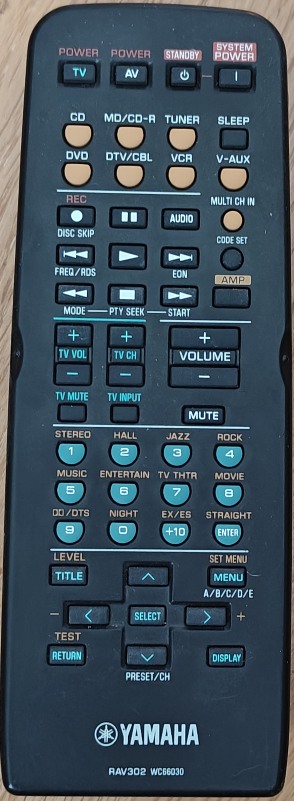

ESPHome IR-Transmitter for Yamaha RX-V420 amplifier.
====================================================

I have really old amp, and it's been much unused for years as it's not
controllable from modern device. Until now. This code makes ESPHome to
send all remote buttons via infra-red, and exposes the buttons to
Home-Assistant. Better late than never.

I tried years ago, but LIRC could not for some reason handle both the
power on and off events, so it wasn't good enough. ESPHome does it.
But if someone is using LIRC, I save here my recorded LIRC codes as well.

I use Pioneer codes for the transmitter, as they are the shortest. Lirc
codes below are RC6 codes. Codes for the both here:

## ir-keycodes yamaha rav302

LIRC reading:
```
sudo ir-keytable -p NEC,RC6 -vt
```

ESPHome reading:
```
remote_receiver:
  pin:
    number: ${rx_pin}
    inverted: true
  dump: all
```

| button    | lirc   | ESPHome |
|-----------|--------|---------|
| standby   | 0x7a1e | 0x5E1E  |
| power     | 0x7a1d | 0x5E1D  |
| cd        | 0x7a15 | 0x5E15  |
| md/cd-r   | 0x7ac9 | 0x5EC9  |
| tuner     | 0x7ac9 | 0x5E16  |
| sleep     | 0x7a57 | 0x5E57  |
| dvd       | 0x7ac1 | 0x5EC1  |
| dtv/cbl   | 0x7a54 | 0x5E54  |
| vcr       | 0x7a0f | 0x5E0F  |
| v-aux     | 0x7a55 | 0x5E55  |
| multi-ch-in| 0x7a87| 0x5E87  |
| vol-up    | 0x7a1a | 0x5E1A  |
| vol-down  | 0x7a1b | 0x5E1B  |
| mute      | 0x7a1c | 0x5E1C  |
| 1-stereo  | 0x7a88 | 0x5E88  |
| 2-hall    | 0x7a89 | 0x5E89  |
| 3-jazz    | 0x7a8a | 0x5E8A  |
| 4-rock    | 0x7a8b | 0x5E8B  |
| 5-music   | 0x7a8c | 0x5E8C  |
| 6-entertain|0x7a8d | 0x5E8D  |
| 7-tv-thtr | 0x7a8e | 0x5E8E  |
| 8-movie   | 0x7a8f | 0x5E8F  |
| 9-dolby-dts|0x7a90 | 0x5E90  |
| 0-night   | 0x7a95 | 0x5E95  |
| +10-ex-es | 0x7a97 | 0x5E97  |
| enter-straight|0x7a56 |0x5E56|
| title-level|0x7a86 | 0x5E86  |
| menu-setmenu|0x7a9c| 0x5E9C  |
| up        | 0x7a86 | 0x5E98  |
| down      | 0x7a99 | 0x5E99  |
| left      | 0x7a53 | 0x5E53  |
| right     | 0x7a52 | 0x5E52  |
| select    | 0x7ade | 0x5EDE  |
| return-test|0x7a85 | 0x5E85  |



# Installing

Compile and upload:
```
sudo podman run --rm --privileged -v "${PWD}":/config --device=/dev/ttyUSB0 \
  -it ghcr.io/esphome/esphome run --device=192.168.1.155 yamaha.yml
```
In initial flashing you can drop the ip address. For later OTA updates
fix the IP, and you can drop the usb dev.

# Device Manual

Yamaha amp manual is [online here](https://de.yamaha.com/files/download/other_assets/6/327556/RX-V450_G_en.pdf).

Hope this still helps someone, at least it's backup for myself :D

- Ilkka Tengvall
